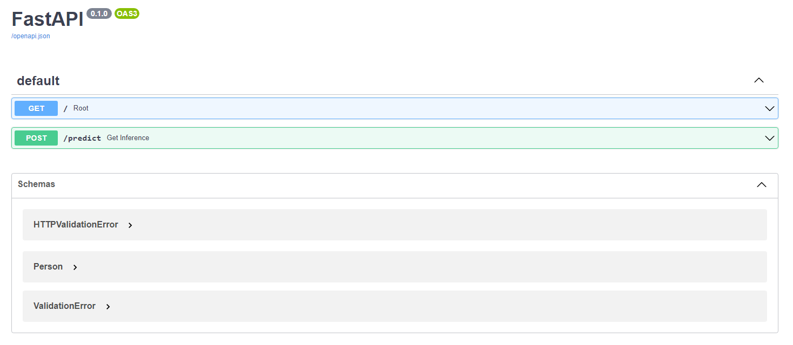

Universidade Federal do Rio Grande do Norte

Programa de Pós Graduação em Engenharia Elétrica e de Computação

EEC1509 - APRENDIZAGEM DE MÁQUINA - T01 - 2022.1

Nome: Mateus Arnaud Goldbarg (20211027690)

# Fundamentos de Machine learning e Árvore de Decisão

Este projeto tem tem como objetivo a aplicação de técnias de Machine Learning usando Árvore de decisão para classificação usando o dataset [Prima Indians Diabetes](https://www.kaggle.com/datasets/uciml/pima-indians-diabetes-database) e também sua implementação. Todos os passos referentes ao EDA, treinamento e teste de modelo e aquisição de artefatos podem ser encontrados em [Machine Learning Fundamentals and Decision Trees for diabetes dataset](https://github.com/mateusArnaudGoldbarg/diabetes_decision_tree).


# Project Overview

In this project, we will apply the skills acquired in the [Machine Learning Fundamentals and Decision Trees](https://github.com/ivanovitchm/ppgeecmachinelearning/tree/main/lessons/week_02/sources) lesosn, diven by [Ivanovich Silva](https://github.com/ivanovitchm), to deploy a classification model using [Prima Indians Diabetes](https://www.kaggle.com/datasets/uciml/pima-indians-diabetes-database) database. All steps of EDA, model training, model testing and others is found in [Machine Learning Fundamentals and Decision Trees for diabetes dataset](https://github.com/mateusArnaudGoldbarg/diabetes_decision_tree).

I deployed the model using the [FastAPI](https://fastapi.tiangolo.com/) package and create API tests. The API tests will be incorporated into a CI/CD framework using GitHub Actions. After this, I've build the API locally, test it and then deployed it to [Heroku](https://www.heroku.com/) and test it again once live. [Weights & Biases](https://wandb.ai/) was used to manage and tracking all artifacts created during ETL (Extract, Transform, Load), training and testing model.


<center></center>


## :arrow_forward: Environment Setup

Create a conda environment with ``environment.yml``:

```bash
conda env create --file environment.yml
```

To remove an environment in your terminal window run:

```bash
conda remove --name myenv --all
```

To list all available environments run:

```bash
conda env list
```

To activate the environment, use

```bash
conda activate myenv
```

## :twisted_rightwards_arrows: API Deployment with FastAPI

[FastAPI](https://fastapi.tiangolo.com/) is a modern API framework that allows you to write code quickly without sacrificing flexibility or extensibility. FastAPI will be used in this project in order to conclude the CI/CD stages. After we build our API locally and test it, we will deploy it to [Heroku](https://www.heroku.com/) and test it again once live.

An important note, don't forget [Wandb](https://wandb.ai/), we need to login to it. In the terminal run:

```
wandb login <paste your api key here>
```

### API Creation

It was created and implemented a RESTful API using FastAPI containing the following features:

- Pydantic body with all columns and hints of an instance. 
- A ``schema extra`` describing an typical example of an instance according FastAPI [documentation](https://fastapi.tiangolo.com/tutorial/schema-extra-example/).
- GET on the root giving a welcome message.
- POST on the predict in order to proceed model inference. 
- Three unit test to test the API, one for the GET and two for POST (high income >50k and low income <=50k)

The API is implemented in the ``source/api/main.py`` whereas tests are on ``source/api/test_main.py``.

For the sake of understanding and during the development, the API was constanly tested using:

```bash
uvicorn source.api.main:app --reload
```

and using these addresses:

```bash
http://127.0.0.1:8000/
http://127.0.0.1:8000/docs
```

The screenshot below show a view of the API docs.

<center></center>

For test the API, please run:

```bash
pytest source/api -vv -s
```

## :gear: Introduction to CI/CD

There are nearly as many ```principles``` of software engineering as grains of sand on a beach. Many principles focus on the process of writing code (such as the Single Responsibility Principle that states that every module/class/function should serve a single purpose), but for our purposes here we will focus on principles that pertain to **model deployment**.

Specifically we will focus on **automation**, **testing**, and **versioning**. None of these are unique to deploying a model, but each one plays an important role as we will see in the following videos.

These principles leads us into **Continuous Integration** and **Continuous Delivery** (CI/CD). To put CI/CD into practice we will leverage [GitHub Actions](https://github.com/features/actions) and [Heroku](https://www.heroku.com/), respectively.

**Continuous Integration** and **Continuous Delivery** (or Deployment) (CI/CD) is a core driver of putting software engineering principles into practice.

Continuous integration is the practice of ensuring changes to the code fit into the overall code base. This is done by running our unit test suite and attempting to build the code on any platforms we choose to target. If this succeeds then the code is integrated. **A robust testing suite is the backbone of a reliable continuous integration procedure**.

If continous integration is the practice of making sure code is always deployable, then continuous delivery is the practice of keeping code actually deployed. CD allows you to make changes to the code, have it be verified by your CI process, and then immediately get served to your users without downtime.

### Continuous Integration with GitHub Actions

GitHub Actions is CI/CD **built right into GitHub** and comes with a plethora of **pre-built workflows** such as running your test suite or checking in if your code has any flake8 errors.

Setting up a GitHub Action is as straightforward as specifying when the action occurs, such as on push, what sort of VM it runs on, what programs and packages it installs, and then ultimately what commands get run. Here is a portion of the template workflow for Python that GitHub provides:

```yml
name: Python package # Name of the Action.

on: [push] # When this action runs.

jobs:
  build:

    runs-on: ubuntu-latest # Which OS this runs on, you can also build on Windows or MacOS.
    strategy:
      matrix:
        python-version: [3.6, 3.7, 3.8] # You can build against multiple Python versions.

    steps:
    - uses: actions/checkout@v2 # Calling a pre-built GitHub Action which allows your Action to access your repository.
    - name: Set up Python ${{ matrix.python-version }} # Name of an action that sets up Python.
      uses: actions/setup-python@v2 # A pre-built GitHub Action that sets up a Python environment.
      with:
        python-version: ${{ matrix.python-version }}
    - name: Install dependencies # The first step that isn't just calling another action.
      run: |
        python -m pip install --upgrade pip # Upgrade pip to the latest version.
        pip install pytest # Install pytest.
        if [ -f requirements.txt ]; then pip install -r requirements.txt; fi # If we have a requirements.txt, then install it.
    - name: Test with pytest # Final action which runs pytest. If any test fails, then this Action fails.
      run: |
        pytest
```

See the inline comments for details on the steps in this workflow.

Beyond CI/CD GitHub Actions can also automate actions such as greeting users when they submit their first pull request to your repository.

Other popular platforms for CI/CD include [CircleCI](https://circleci.com/), [TravisCI](https://www.travis-ci.com/), and [Jenkins](https://www.jenkins.io/).

<center></center>

## :atom_symbol: Introduction to Heroku

[Heroku](https://www.heroku.com/) is a **cloud Platform-as-a-Service** (PaaS) that supports a variety of languages and allows users to deploy apps. For our purposes, we will use Heroku to run a Python application that consists of an API for machine learning inference.

Heroku is built around the concept of lightweight containers called [dynos](https://devcenter.heroku.com/articles/dynos) that are easily scalable and adaptable to a variety of tasks. For our work, we will be using one web dyno to run our API.

The instructions for launching an app are contained in a ```Procfile``` file that resides in the highest level of your project directory. This file declares the dyno type (web) and the associated command on each line, e.g.:

```bash
web: uvicorn source.api.main:app
```

This ```Procfile``` specifies a web dyno that runs the command ```uvicorn``` which is then running a web app cleverly called ```app``` that resides in ```source/api/main.py```.

One great benefit to Heroku is that its [free to start out](https://devcenter.heroku.com/articles/getting-started-with-python)!

### Continuous Deployment with Heroku

>Heroku makes it easy to do CD. 

It provides multiple different deployment options with the two most common being ```Git``` and ```Docker``` based deployments. **We will leverage the GitHub connection**.

You can connect an existing repository to Heroku either using the web GUI or the CLI and from there you can enable continuous delivery so that all changes to your code automatically get deployed to your Heroku app. Furthermore, you can specify that the CD only occurs when your continuous integration (e.g. your unit tests) succeeds. Doing this tightly couples our CI and CD processes which will help us avoid deploying a broken app.

When creating apps on Heroku, it's important to think of your ```slug``` and its limitations. 

> The slug is your app and all of its dependencies, and it has a **size limit of 500 MB**.

For light use cases all of your code, model, and even data could fit within that limit. However large models or frameworks (such as TensorFlow 2) can easily exceed the limit. Where possible, trim what is included in your slug using a .slugignore file, and in our case, we can leverage our remote [W&B storage](https://wandb.ai) to contain our model and data and access them in our app when we need them.

## :exploding_head: Heroku Fundamentals Expanded

In the previous section we covered a few fundamentals of Heroku such as ```dynos```, ```slugs```, and the ```Procfile```. Now we will put those fundamentals **to work in deploying a web app to Heroku**.

Heroku operates on a handful of [key principles](https://devcenter.heroku.com/articles/runtime-principles), a few of which we discuss here. 

> We already touched on dynos which are virtualized containers used for running discrete processes. This connects directly to **statelessness**. Heroku does not store or cache any of your data. 

If you want to save anything then you must connect your app some form of external storage. Likewise, processes are seen as **disposable**. They can be started or stopped at any time. This is what allows rapid iteration, fault tolerance, and scalability with Heroku.

Heroku's last principle which is the undercurrent throughout everything we have discussed is that of **build, release, run**. Heroku breaks the app life-cycle into three discrete stages. Whenever we interact with Heroku we are interacting with one of these discrete stages.

And finally, the ```Procfile``` previously shown was missing a few crucial pieces to get it to function on Heroku. The full file is:

```bash
web: uvicorn source.api.main:app --host=0.0.0.0 --port=${PORT:-5000}
```

Previously when we locally deployed our app it automatically used 127.0.0.1 which is the localhost. Here we use ```0.0.0.0``` which is the IP used to tell a server **to listen on every open network interface**. Heroku dynamically assigns the port to the ```PORT``` variable. In Unix ```${VARIABLE:-default}``` is used to assign a default if ```VARIABLE``` is not set, so here we set the port CLI option to ```PORT``` and failing that set it to 5000.

For the sake of summarization, it follows the Heroku concept and its description.

- **dyno**: Heroku containers.
- **statelessness**: Heroku does not cache any data.
- **slug**: Compressed copy of your app.
- **disposable**: Processes can be started or stopped at any time.
- **procfile**: File that Heroku uses to launch commands on startup.

## :arrow_forward: Delivery your API with Heroku

1. Sign up for free and experience [Heroku](https://signup.heroku.com/login).
2. Now, it's time to create a new app. It is very important to connect the APP to our Github repository and enable the automatic deploys.
3. Install the Heroku CLI following the [instructions](https://devcenter.heroku.com/articles/heroku-cli).
4. Sign in to heroku using terminal
```bash
heroku login
```
5. In the root folder of the project check the heroku projects already created.
```bash
heroku apps
```
6. Check buildpack is correct: 
```bash
heroku buildpacks prima-indians-app 
```
7. Update the buildpack if necessary:
```bash
heroku buildpacks:set heroku/python --app prima-indians-app
```
8. When you're running a script in an automated environment, you can [control Wandb with environment variables](https://docs.wandb.ai/guides/track/advanced/environment-variables) set before the script runs or within the script. Set up access to Wandb on Heroku, if using the CLI: 
```bash
heroku config:set WANDB_API_KEY=xxx --app prima-indians-app
```
9. The instructions for launching an app are contained in a ```Procfile``` file that resides in the highest level of your project directory. Create the ```Procfile``` file with:
```bash
web: uvicorn source.api.main:app --host=0.0.0.0 --port=${PORT:-5000}
```
10. Configure the remote repository for Heroku:
```bash
heroku git:remote --app prima-indians-app
```
11. Push all files to remote repository in Heroku. The command below will install all packages indicated in ``requirements.txt`` to Heroku VM. 
```bash
git push heroku main
```
12. Check the remote files run:
```bash
heroku run bash --app prima-indians-app
```
13. If all previous steps were done with successful you will see the message below after open: ```https://prima-indians-app.herokuapp.com/``` or ```https://prima-indians-app.herokuapp.com/docs```.
14. For debug purposes whenever you can fetch your app’s most recent logs, use the [heroku logs command](https://devcenter.heroku.com/articles/logging#view-logs):
```bash
heroku logs
```

