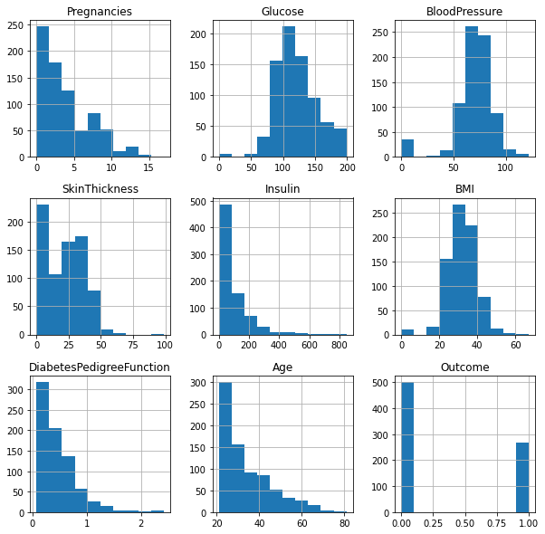

# Model Card

Model cards are a succint approach for documenting the creation, use and shortcomingsof a model. The idea is to write a documentation such as a non-expert can understand the model card's contents. For additional informnation about Model Card look the paper: https://arxiv.org/pdf/1810.03993.pdf

## Model Details

Workflow pipeline:

The hyperparameter-tunning was conducted useind a Random Sweep fo WandB and the parameters adopted in train were:

* full_pipeline__num_pipeline__num_transformer__model": 0
* classifier__criterion": 'gini'
* "classifier__splitter": 'random'
* "classifier__random_state": 41
* "classifier__max_depth": 4

## Workflow to build a model

- [Fetch Data](https://github.com/mateusArnaudGoldbarg/diabetes_decision_tree/blob/main/source/fetch_data.ipynb)
- [EDA](https://github.com/mateusArnaudGoldbarg/diabetes_decision_tree/blob/main/source/eda.ipynb)
- [Preprocessing](https://github.com/mateusArnaudGoldbarg/diabetes_decision_tree/blob/main/source/preprocessing.ipynb)
- [Data Check](https://github.com/mateusArnaudGoldbarg/diabetes_decision_tree/blob/main/source/data_check.ipynb)
- [Data Segregation](https://github.com/mateusArnaudGoldbarg/diabetes_decision_tree/blob/main/source/data_segregation.ipynb)
- [Train](https://github.com/mateusArnaudGoldbarg/diabetes_decision_tree/blob/main/source/train.ipynb)
- [Test](https://github.com/mateusArnaudGoldbarg/diabetes_decision_tree/blob/main/source/test.ipynb)

## Dataset

This dataset is originally from the National Institute of Diabetes and Digestive and Kidney Diseases. The objective of the dataset is to diagnostically predict whether or not a patient has diabetes based on certain diagnostic measurements (features) of females with at least 21 years old.

The datasets consists of the following features:

- Pregnancies: Number of pregnancies;
- Glucose: Plasma glucose concentration a 2 hours in an oral glucose tolerance test;
- BloodPressure: Diastolic blood pressure (mm Hg);
- SkinThickness: Triceps skin fold thickness (mm);
- Insulin: 2-Hour serum insulin (mu U/ml);
- BMI: Body mass index (weight in kg/(height in m)^2);
- DiabetesPedigreeFunction: Probability of the pacient have diabetes based on family historic;
- Age: Age (years);
- Outcome: Output class variable (0 or 1);
- This is an unbalanced dataset, where 268 of 768 are 1 (diabetic), and 500 are 0 (healty).

All features on dataset are numeric (float and int).

## Data segregation
The dataset was divided with 70% for training and 30% for testing.

## Metrics

In order to follow the perfomance of machine learning experiments, the project markes certains stage of the data pipeline as metrics. The metrics adopted are:
* [accuracy](https://scikit-learn.org/stable/modules/generated/sklearn.metrics.accuracy_score.html);
* [f1](https://scikit-learn.org/stable/modules/generated/sklearn.metrics.f1_score.html#sklearn.metrics.f1_score);
* [precision](https://scikit-learn.org/stable/modules/generated/sklearn.metrics.precision_score.html#sklearn.metrics.precision_score); and
* [recall](https://scikit-learn.org/stable/modules/generated/sklearn.metrics.recall_score.html#sklearn.metrics.recall_score).

After sweeping process at WandB, the best values found ordered by accuracy was:
- accuracy: 0.7225;
- f1: 0.5545;
- precision: 0.6222;
- recall: 0.5